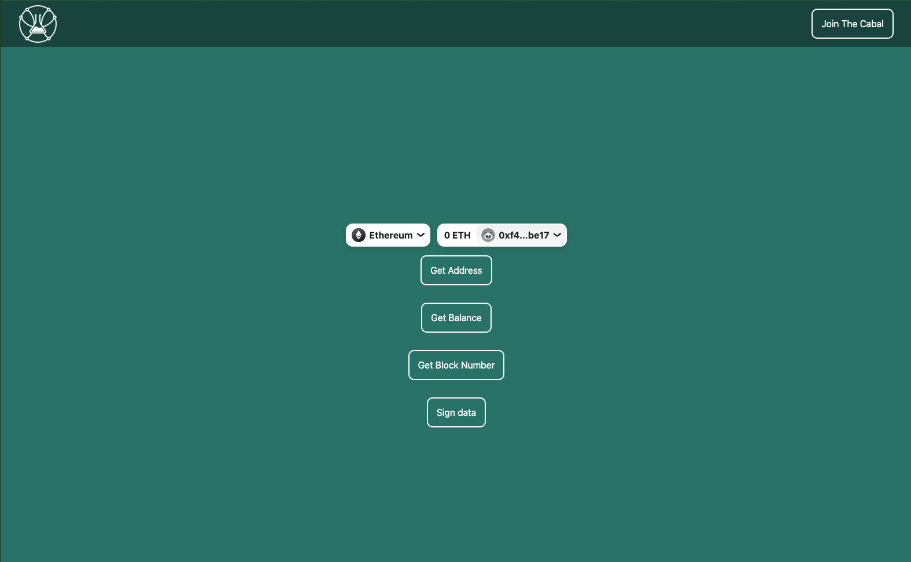

# Rainbow-Cabal Start Kit

A starting kit for using the Rainbow kit, a web3 button connector for different wallets, with Wagni, a React Hooks SDK for web3, built using Next.js.

## Getting Started

These instructions will get you a copy of the project up and running on your local machine for development and testing purposes.

### Prerequisites

Before you start, make sure you have the following tools installed:

- Node.js
- npm

### Installation

1. Clone the repo to your local machine using:
```
git clone https://github.com/Cabal-Labs/rainbow-cabalkit.git
```

2. Install the dependencies using npm:

```
npm install
```
3. Start the development server:

```
npm run dev
```

### Examples

The repo includes a couple of buttons that demonstrate how to set up both Rainbow kit and Wagni in a Next.js project. You can use these buttons as a starting point for your own implementation.

## Contributing

If you find any issues or have any suggestions, feel free to open an issue or submit a pull request.

## License

This project is licensed under the MIT License - see the [LICENSE](https://github.com/Cabal-Labs/rainbow-cabalkit/blob/main/LICENSE) file for details.
