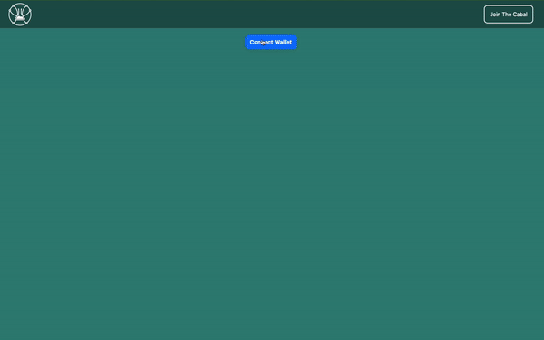

# Rainbow-Cabal Start Kit


A starting kit for using the Rainbow kit, a web3 button connector for different wallets, with Wagmi, a React Hooks SDK for web3, built using Next.js. 

## Getting Started
 In this guide, we'll show you how to set up the RainbowKit button and demonstrate how to use the different Ethereum React hooks from Wagmi.
These instructions will get you a copy of the project up and running on your local machine for development and testing purposes.

### Prerequisites

Before you start, make sure you have the following tools installed:

- Node.js
- npm

You'll also need an Alchemmy API key. [Alchemy](https://www.alchemy.com/) API key.


### Installation

1. Clone the repo to your local machine using:
```bash
git clone https://github.com/Cabal-Labs/rainbow-cabalkit.git
```

2. Install the dependencies using npm:

```bash
npm install
```
3. Go to [_app.js](https://github.com/Cabal-Labs/rainbow-cabalkit/blob/main/pages/_app.js) & insert your [Alchemy](https://www.alchemy.com/) key
4. Start the development server:

```bash
npm run dev
```

## [Examples](https://github.com/Cabal-Labs/rainbow-cabalkit/blob/main/components/main.js)

The repo includes a couple of buttons that demonstrate how to set up both Rainbow kit and Wagmi in a Next.js project. You can use these buttons as a starting point for your own implementation.

### Rainbow Kit
Set up Rainbow kit in your own project

1. Install the following packages:

```bash     
npm install @rainbow-me/rainbowkit wagmi ethers
```
2. Import the configs into the root of your project:

```js
// Example from Rainbow kit (https://www.rainbowkit.com/docs/installation)
// Our implementation is on https://github.com/Cabal-Labs/rainbow-cabalkit/blob/main/pages/_app.js
 import '@rainbow-me/rainbowkit/styles.css';

import {
  getDefaultWallets,
  RainbowKitProvider,
} from '@rainbow-me/rainbowkit';
import { configureChains, createClient, WagmiConfig } from 'wagmi';
import { mainnet, polygon, optimism, arbitrum } from 'wagmi/chains';
import { alchemyProvider } from 'wagmi/providers/alchemy';
import { publicProvider } from 'wagmi/providers/public';
```
3. Configure the chains and connectors in the same file:

```js
// Example from Rainbow kit (https://www.rainbowkit.com/docs/installation)
// Our implementation is on https://github.com/Cabal-Labs/rainbow-cabalkit/blob/main/pages/_app.js

const { chains, provider } = configureChains(
  [mainnet, polygon, goerli],
  [
    alchemyProvider({ apiKey: "YOUR_ALCHEMY_KEY" }),
    publicProvider()
  ]
);

const { connectors } = getDefaultWallets({
  appName: 'My RainbowKit App',
  chains
});

const wagmiClient = createClient({z
  connectors,
  provider
})
```
4. Wrap your app in the RainbowKitProvider and Wagmi client:

```js
// Example from Rainbow kit (https://www.rainbowkit.com/docs/installation)
// Our implementation is on https://github.com/Cabal-Labs/rainbow-cabalkit/blob/main/pages/_app.js

const App = () => {
  return (
    <WagmiConfig client={wagmiClient}>
      <RainbowKitProvider chains={chains}>
        <YourApp />
      </RainbowKitProvider>
    </WagmiConfig>
  );
};
```

We are implementing different React Hooks from Wagmi:

- [useAccount](https://github.com/Cabal-Labs/rainbow-cabalkit#accessing-the-users-web3-wallet-account)
- [useBlockNumber](https://github.com/Cabal-Labs/rainbow-cabalkit#reading-the-latest-block-from-the-blockchain)
- [useBalance](https://github.com/Cabal-Labs/rainbow-cabalkit#reading-the-users-wallet-balance)
- [useSignMessage](https://github.com/Cabal-Labs/rainbow-cabalkit#signing-messages)
- [useEnsName](https://github.com/Cabal-Labs/rainbow-cabalkit#searching-for-the-ens-name-from-a-wallet-address)
- [useSendTransaction](https://github.com/Cabal-Labs/rainbow-cabalkit#sending-blockchain-transactions)

### Accessing the user's Web3 wallet account
To access information about the user's Web3 wallet account, you can use the `useAccount` hook from Wagmi:

```js
// Exmaple from Wagmi (https://wagmi.sh/)
// Our implementation is on https://github.com/Cabal-Labs/rainbow-cabalkit/blob/main/components/main.js

import { useAccount } from 'wagmi'
 
function App() {
  const { address, isConnecting, isDisconnected } = useAccount()
 
  if (isConnecting) return <div>Connecting…</div>
  if (isDisconnected) return <div>Disconnected</div>
  return <div>{address}</div>
}
```
### Reading the latest block from the blockchain
To read the latest block from the blockchain, you can use the `useBlockNumber` hook from Wagmi:

```js
// Exmaple from Wagmi (https://wagmi.sh/)
// Our implementation is on https://github.com/Cabal-Labs/rainbow-cabalkit/blob/main/components/main.js

import { useAccount } from 'wagmi'
 
import { useBlockNumber } from 'wagmi'
 
function App() {
  const { data, isError, isLoading } = useBlockNumber()
 
  if (isLoading) return <div>Fetching block number…</div>
  if (isError) return <div>Error fetching block number</div>
  return <div>Block number: {data}</div>
}
```
### Reading the user's wallet balance
To read the user's wallet balance, you can use the `useBalance` hook from Wagmi:

```js
// Exmaple from Wagmi (https://wagmi.sh/)
// Our implementation is on https://github.com/Cabal-Labs/rainbow-cabalkit/blob/main/components/main.js

import { useBalance } from 'wagmi'
 
function App() {
  const { data, isError, isLoading } = useBalance({
    address: '0xA0Cf798816D4b9b9866b5330EEa46a18382f251e',
  })
 
  if (isLoading) return <div>Fetching balance…</div>
  if (isError) return <div>Error fetching balance</div>
  return (
    <div>
      Balance: {data?.formatted} {data?.symbol}
    </div>
  )
}
```
### Signing messages
To sign messages, you can use the `useSignMessage` hook from Wagmi:

```js
// Exmaple from Wagmi (https://wagmi.sh/)
// Our implementation is on https://github.com/Cabal-Labs/rainbow-cabalkit/blob/main/components/main.js

import { useSignMessage } from 'wagmi'
 
function App() {
  const { data, isError, isLoading, isSuccess, signMessage } = useSignMessage({
    message: 'gm wagmi frens',
  })
 
  return (
    <div>
      <button disabled={isLoading} onClick={() => signMessage()}>
        Sign message
      </button>
      {isSuccess && <div>Signature: {data}</div>}
      {isError && <div>Error signing message</div>}
    </div>
  )
}
```
### Searching for the ENS name from a wallet address
To search for the ENS name from a wallet address, you can use the `useEnsName` hook from Wagmi:

```js
// Exmaple from Wagmi (https://wagmi.sh/)
// Our implementation is on https://github.com/Cabal-Labs/rainbow-cabalkit/blob/main/components/main.js

import { useEnsName } from 'wagmi'
 
function App() {
  const { data, isError, isLoading } = useEnsName({
    address: '0xA0Cf798816D4b9b9866b5330EEa46a18382f251e',
  })
 
  if (isLoading) return <div>Fetching name…</div>
  if (isError) return <div>Error fetching name</div>
  return <div>Name: {data}</div>
}
```
### Sending blockchain transactions
To send blockchain transactions, you can use the `useSendTransaction` hook from Wagmi:

```js
// Exmaple from Wagmi (https://wagmi.sh/)
// Our implementation is on https://github.com/Cabal-Labs/rainbow-cabalkit/blob/main/components/main.js

import { useSendTransaction, usePrepareSendTransaction } from 'wagmi'
 
function App() {
  const { config } = usePrepareSendTransaction({
    request: { to: 'moxey.eth', value: BigNumber.from('10000000000000000') },
  })
  const { data, isLoading, isSuccess, sendTransaction } =
    useSendTransaction(config)
 
  return (
    <div>
      <button disabled={!sendTransaction} onClick={() => sendTransaction?.()}>
        Send Transaction
      </button>
      {isLoading && <div>Check Wallet</div>}
      {isSuccess && <div>Transaction: {JSON.stringify(data)}</div>}
    </div>
  )
}
```


## Contributing

If you find any issues or have any suggestions, feel free to open an issue or submit a pull request.

## License

This project is licensed under the MIT License - see the [LICENSE](https://github.com/Cabal-Labs/rainbow-cabalkit/blob/main/LICENSE) file for details.
